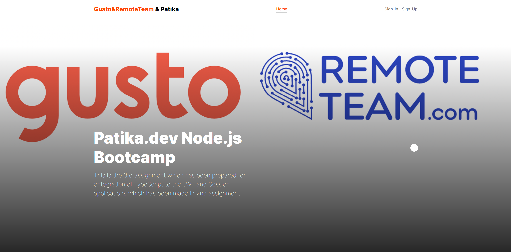
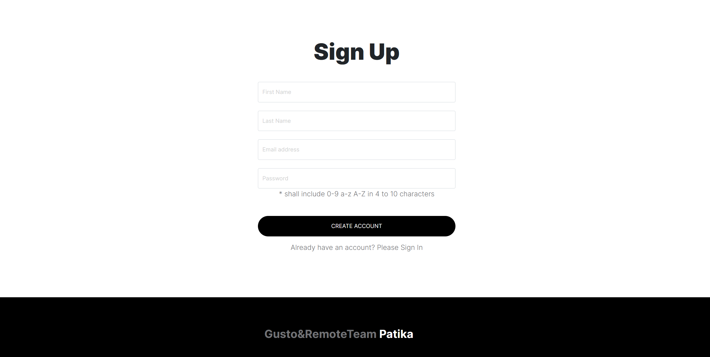
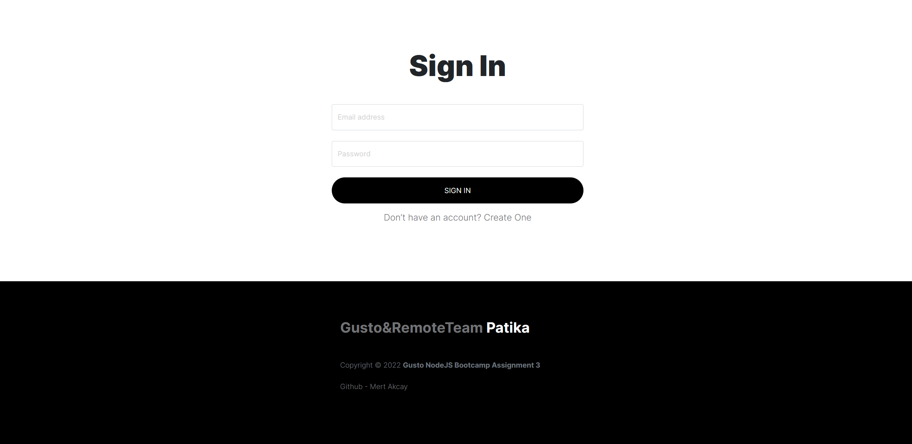

# Gusto&RemoteTeam Bootcamp Assignment-3
### This is the 3rd assignment which has been prepared for entegration of TypeScript to the JWT and Session applications which has been made in 2nd assignment
### The technologies that's been used after 2nd assignment are;
- TypeScript
- Typeorm

### In every login, user's ID and browser info is stored in session and a JWT Token. This token and session ID returns to the client with cookies. 
### After this process, every authentication-required operation can be done after comparison of browser infos and userIDs in Session, JWT and Request(cookies) 

 
 

## Home Page

## Sign-up Page

## Sign-in Page

## Users Page
